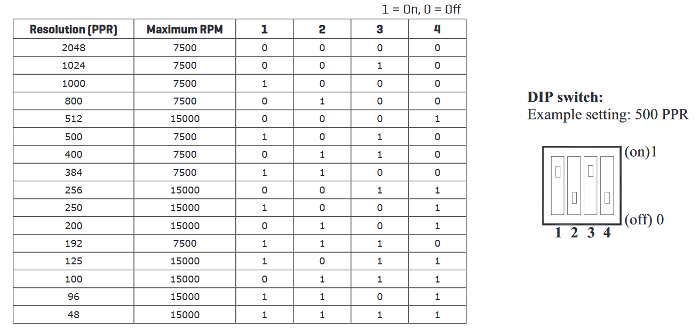

# revolution_control
### フローチャート

表示

 

***※太字斜体下線の文字列はパラメータで設定する値***

### 通信データ ( M->S )
    1. 書き込み禁止
    2. 目標回転数 1 上位 8 bit [ rpm ]
    3. 目標回転数 1 下位 8 bit [ rpm ]
    4. 目標回転数 2 上位 8 bit [ rpm ]
    5. 目標回転数 2 下位 8 bit [ rpm ]
### 通信データ ( S->M )
    1. 現在の回転数 1 上位 8 bit [ rpm ]
    2. 現在の回転数 1 下位 8 bit [ rpm ]
    3. 現在の回転数 2 上位 8 bit [ rpm ]
    4. 現在の回転数 2 下位 8 bit [ rpm ]
    5. 出力 PWM1 ( -100 ～ 100 )
    6. 出力 PWM2 ( -100 ～ 100 )
### パラメータ
    1. PWM 最大値 ( 1 ～ 100 )
    2. エンコーダ極性 ( 0 or 1 )
    3. エンコーダ分解能 ( 1 ～ )
    4. 停止回転数 ( 1 ～ ) [ rpm ]
    5. 停止 PWM  ( 1 ～ 100 )
    6. 比例ゲイン ( 未使用時：0 / 使用時：1 ～ )

詳細

* PWM 最大値
    * 制御基板から出力する PWM 波形 のデューティー比の最大値
    * 「PWM 最大値」よりも大きな値がマスターから指定された場合は，「PWM 最大値」が代わりに使用される
    * 極力小さな値を指定することで，マスター側のプログラムに不具合が生じてもモータの暴走を防ぐことができる
* エンコーダ極性
    * エンコーダのパルスから計算した回転数の符号を反転するかどうかを指定する
    * モータが正転したときに，エンコーダから求められる回転数が正になるように指定する
    * エンコーダの取り付けられている向きや，ギヤのかまされ方に応じて変わる
    * 極性が間違っていたら通信が止まって LED が一定の間隔で点滅する．その場合は単純に極性を逆に設定すればよい．
* エンコーダ分解能
    * 分解能（１回転で何パルス出力されるか）を指定する
    * 古いエンコーダ ( RE30E-300-213-1 ) は分解能 300，新しいエンコーダ ( AMT102-V ) は DIP スイッチで分解能を設定できる．（分解能 384 で使うことが多い）
    * 新しいエンコーダ ( AMT102-V ) に関して，DIP スイッチと分解能の関係を下図に示す．( [引用元](https://www.cuidevices.com/product/resource/amt10.pdf) )
    
* 停止回転数
    * モータが停止したと判断する回転数の最大値を指定する
    * 出力する PWM 波形のデューティー比は次式で決定している
    * 従って非常停止などによって駆動電源が投入されていない状態で 0 以外の回転数目標値を指定されると，１つ目のパラメータで設定した「PWM 最大値」に到達するまでデューティー比は増加し続ける． 
    この状態で駆動電源を投入する ( 非常停止を解除する ) と，いきなり「PWM 最大値」のデューティー比でモータが駆動されてしまう． 
    そこで，「停止回転数」で指定した回転数よりも回転数現在値が小さい場合はモータが停止していると判断して，次の項目で説明する「停止 PWM」をデューティー比の上限とする．
* 停止 PWM
    * 「停止回転数」の項目を参照すること
* 比例ゲイン
    * 「停止回転数」の項目を参照すること
    * 大きめの値に設定することによってモータの加減速処理を行うことが可能．<u>***ただし，足回りを制御する際には比例ゲインは小さめにして加減速処理は別に実装する方が好ましい．***</u>

### 使用している周辺モジュール
|モジュール名|用途|
|:-|:-|
|UART1(TX, RX)|Raspberry Pi との送受信|
|QEI1, QEI2|ロータリーエンコーダ|
|Timer1|フィードバック制御の計算周期の調整|
|Timer2|OC 用|
|OC1, OC2|DC モータを制御するための PWM|